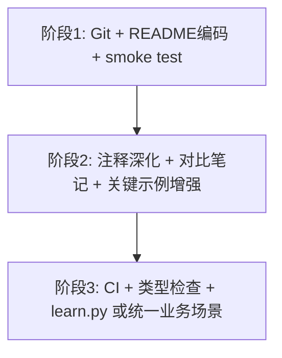

# 后续任务清单

GoF 23 种设计模式 Python 扁平项目 — 进度跟踪。已完成项来自首轮实现（MVP）。

---

## 已完成（MVP）

- [x] 创建型 5 个示例：`01_singleton.py` ~ `05_prototype.py`
- [x] 结构型 7 个示例：`06_adapter.py` ~ `12_proxy.py`
- [x] 行为型 11 个示例：`13_chain_of_responsibility.py` ~ `23_visitor.py`
- [x] 每个模式文件含 `demo()` + `if __name__ == "__main__"`
- [x] 脚手架：`README.md`、`requirements.txt`、`.gitignore`、`run_all.py`
- [x] `run_all.py` 全量运行 23 个示例（已本地验证通过）
- [x] README 模式索引表与运行说明
- [x] Windows 控制台编码兼容（去除 ¥/emoji，`run_all.py` UTF-8 重配置）

---

## 一、巩固与质量（建议优先）

- [ ] **Git 初始化与首次提交** — `git init`，提交全部项目文件，便于版本对比与回滚
- [ ] **README 补充 Windows 编码说明** — 明确 `PYTHONIOENCODING=utf-8`、PowerShell 乱码处理步骤
- [ ] **为每个模式补充「反例/误用」注释** — 如单例线程安全、装饰器 vs 继承等，每文件 3～5 行
- [ ] **添加 `test_patterns.py`（可选 pytest）** — 对每个 `demo()` 做 smoke test（无异常、输出含模式前缀）
- [ ] **CI 流水线（GitHub Actions）** — push 时自动执行 `python run_all.py`

---

## 二、学习与文档深化

- [ ] **每个文件增加 UML 类图（Mermaid）** — 写在文件顶部 docstring 或 README 附录（保持扁平目录）
- [ ] **模式对比笔记** — 工厂方法 vs 抽象工厂、策略 vs 状态、装饰器 vs 代理等
- [ ] **与 Python 标准库对照表** — 如 `functools.wraps`、`abc.ABC`、迭代器协议等
- [ ] **学习路径与自测题** — 按创建型 → 结构型 → 行为型，附 2～3 道简答题/模式
- [ ] **`CHANGELOG.md`** — 记录示例调整与场景变更

---

## 三、示例代码增强（保持根目录扁平）

- [ ] **单例：线程安全版本** — `threading.Lock`，并与现有 demo 对比
- [ ] **责任链：动态增删处理器** — 更贴近中间件链用法
- [ ] **观察者：弱引用观察者** — 避免循环引用
- [ ] **访问者：第二种访问者** — 如 `PrintVisitor`，演示双分派扩展
- [ ] **解释器：扩展加减乘** — 小型 AST，仍控制单文件体量
- [ ] **复杂示例双入口** — 同文件 `demo_basic()` / `demo_advanced()`，不新增子目录

---

## 四、工程化扩展（原计划范围外）

- [ ] **类型检查** — `pyproject.toml` + `mypy` / `pyright`
- [ ] **代码格式化** — `ruff format` 或 `black` 统一风格
- [ ] **交互式学习脚本 `learn.py`** — 菜单选择模式编号并运行对应 demo
- [ ] **速查表生成** — 从各文件 docstring 汇总为 Markdown/HTML

---

## 五、进阶专题（第二阶段）

- [ ] **23 模式 × 同一业务场景** — 如「电商订单」横向对比所有模式
- [ ] **与主流框架对照笔记** — Spring / Django 等内置模式实现
- [ ] **并发/异步变体** — 代理、观察者、命令的 `asyncio` 版本
- [ ] **反模式合集** — `99_anti_*.py` 或独立说明文件
- [ ] **面试题 + 参考答案** — 每模式 2～3 道

---

## 推荐执行顺序



| 阶段 | 建议任务编号 | 目标 |
|------|----------------|------|
| 本周 | 一：1、2、4 | 可版本管理、文档完整、可自动验证 |
| 下周 | 二：6、7；三：11～14 | 加深理解，改动限于现有 23 文件 |
| 按需 | 一：5；四：17～19；五：21 | 工程化与专题，投入较大 |

---

## 快速命令

```powershell
Set-Location f:\commercial\design-patterns-23
python 01_singleton.py      # 单个示例
python run_all.py           # 全部 23 个
```

更新本清单时：将 `[ ]` 改为 `[x]`，并在「已完成」区简要注明完成日期（可选）。
