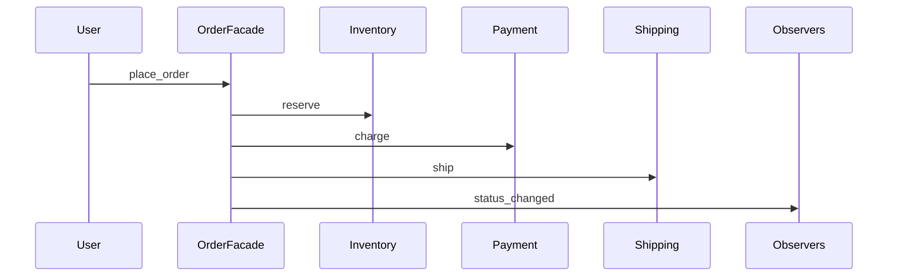

# 23 种设计模式 × 电商订单场景

同一业务主线：**用户下单 → 支付 → 发货 → 完成/取消**。  
各模式在链路中的职责不同，便于横向对比。代码实现见对应 `NN_*.py`。

| # | 模式 | 在订单场景中的角色 | 对应示例文件 |
|---|------|-------------------|--------------|
| 01 | Singleton | 全局订单配置（税率、超时时间）唯一实例 | `01_singleton.py` |
| 02 | Factory Method | 按渠道创建不同日志/通知发送器 | `02_factory_method.py` |
| 03 | Abstract Factory | 切换「国内/海外」整套 UI 或支付组件族 | `03_abstract_factory.py` |
| 04 | Builder | 分步组装下单请求（地址、SKU、优惠券） | `04_builder.py` |
| 05 | Prototype | 复制订单模板生成大促批量草稿单 | `05_prototype.py` |
| 06 | Adapter | 对接 legacy 支付 SDK，统一为 `pay()` 接口 | `06_adapter.py` |
| 07 | Bridge | 订单报表「格式 × 导出渠道」独立变化 | `07_bridge.py` |
| 08 | Composite | 订单行 + 套装子商品树形结构统一计价 | `08_composite.py` |
| 09 | Decorator | 订单价格叠加：会员折扣、满减、运费险 | `09_decorator.py` |
| 10 | Facade | 一键下单门面：库存+支付+物流子系统 | `10_facade.py` |
| 11 | Flyweight | 海量订单行共享「商品元数据」享元 | `11_flyweight.py` |
| 12 | Proxy | 订单详情懒加载大对象（发票 PDF、物流轨迹） | `12_proxy.py` |
| 13 | Chain of Responsibility | 风控/运营/财务多级审批退款金额 | `13_chain_of_responsibility.py` |
| 14 | Command | 取消订单、改地址等操作可撤销/排队 | `14_command.py` |
| 15 | Interpreter | 促销规则表达式 `(满额 AND 品类) OR 券码` | `15_interpreter.py` |
| 16 | Iterator | 遍历订单历史分页，不暴露内部存储 | `16_iterator.py` |
| 17 | Mediator | 买家/卖家/客服聊天室，不直接互引 | `17_mediator.py` |
| 18 | Memento | 订单草稿快照，恢复未提交状态 | `18_memento.py` |
| 19 | Observer | 订单状态变更通知：短信、邮件、App 推送 | `19_observer.py` |
| 20 | State | 订单状态机：待付→已付→已发→完成 | `20_state.py` |
| 21 | Strategy | 运费计算：顺丰/平邮/自提策略切换 | `21_strategy.py` |
| 22 | Template Method | 导出订单：CSV/JSON 固定流程、不同格式 | `22_template_method.py` |
| 23 | Visitor | 对订单树统计金额、打印结构（双访问者） | `23_visitor.py` |

## 一条订单的生命周期（概念）

## 练习建议

1. 先读 `10_facade.py`、`20_state.py`、`19_observer.py` 建立订单主线。
2. 再按上表对照其余模式「若换成订单场景」应插在哪个环节。
3. 思考：哪些模式**同时**出现在真实电商代码中（如 State + Observer + Command）。
