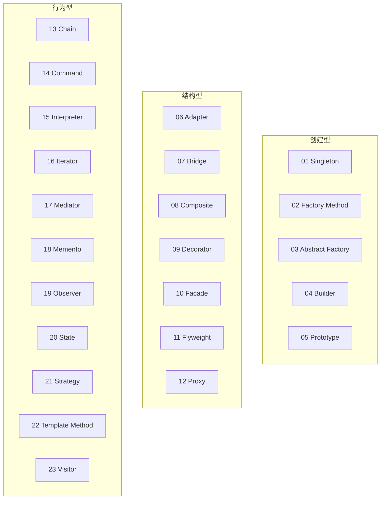
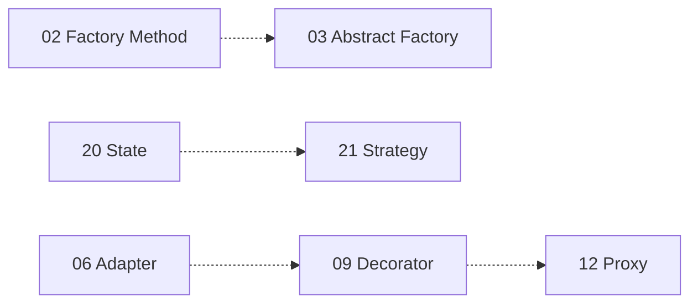

# 设计模式学习指南

本仓库唯一扩展文档。23 个可运行示例在 `patterns/`，UML 类图见各文件顶部 docstring（Mermaid）。

## 快速开始

```powershell
Set-Location f:\commercial\design-patterns-23
python patterns/01_singleton.py      # 单个模式
python scripts/run_all.py              # 全部 23 个
python scripts/learn.py                # 交互菜单（支持分类/模块名）
python scripts/ecommerce_demo.py       # 电商端到端演示
pip install -e .                       # 可编辑安装（见下文）
```

---

## 模式分类与关系

### 分类一览



### 易混淆模式对

| 对比 | 要点 |
|------|------|
| 工厂方法 vs 抽象工厂 | 一种产品 vs 一族产品（主题套件） |
| 策略 vs 状态 | 外部选算法 vs 内部状态驱动行为 |
| 适配器 vs 装饰器 vs 代理 | 改接口 / 增强同接口 / 控制访问 |
| 桥接 vs 策略 | 抽象×实现分离 vs 算法替换 |
| 观察者 vs 中介者 | 一对多广播 vs 多方经中介通信 |
| 命令 vs 备忘录 | 封装可撤销请求 vs 状态快照 |
| 模板方法 vs 访问者 | 子类填步骤 vs 新增操作不改元素类 |



### 速查

| 需求 | 模式 |
|------|------|
| 全局唯一配置 | Singleton |
| 一族产品切换 | Abstract Factory |
| 分步构建复杂对象 | Builder |
| 旧接口对接 | Adapter |
| 动态叠加能力 | Decorator |
| 简化多子系统 | Facade |
| 状态驱动行为 | State |
| 算法可替换 | Strategy |
| 一对多通知 | Observer |
| 撤销操作 | Command |

### 与 Python 语法

- **装饰器模式** ≠ `@decorator` 语法糖（前者是类组合，后者是函数包装）。
- **迭代器**：内置 `__iter__` / `__next__`，见 `patterns/16_iterator.py`。

### UML 类图

不单独维护汇总文件。打开任意 `patterns/NN_*.py`，阅读 docstring 中的 `类图 (Mermaid):` 段，复制到 [mermaid.live](https://mermaid.live) 预览。

---

## 电商订单场景

主线：**下单 → 支付 → 发货 → 通知/取消**。端到端脚本：`python scripts/ecommerce_demo.py`（Facade + Chain + State + Observer + Command）。

| # | 模式 | 在订单中的角色 | 文件 |
|---|------|----------------|------|
| 01 | Singleton | 全局订单配置 | `patterns/01_singleton.py` |
| 02 | Factory Method | 按渠道创建通知器 | `patterns/02_factory_method.py` |
| 03 | Abstract Factory | 国内/海外支付组件族 | `patterns/03_abstract_factory.py` |
| 04 | Builder | 分步组装下单请求 | `patterns/04_builder.py` |
| 05 | Prototype | 复制订单模板 | `patterns/05_prototype.py` |
| 06 | Adapter | 对接 legacy 支付 SDK | `patterns/06_adapter.py` |
| 07 | Bridge | 报表格式×导出渠道 | `patterns/07_bridge.py` |
| 08 | Composite | 订单行+套装树 | `patterns/08_composite.py` |
| 09 | Decorator | 会员折扣、满减叠加 | `patterns/09_decorator.py` |
| 10 | Facade | 库存+支付+物流编排 | `patterns/10_facade.py` |
| 11 | Flyweight | 商品元数据共享 | `patterns/11_flyweight.py` |
| 12 | Proxy | 懒加载发票/物流详情 | `patterns/12_proxy.py` |
| 13 | Chain | 大额退款多级审批 | `patterns/13_chain_of_responsibility.py` |
| 14 | Command | 取消订单可撤销 | `patterns/14_command.py` |
| 15 | Interpreter | 促销规则表达式 | `patterns/15_interpreter.py` |
| 16 | Iterator | 订单历史遍历 | `patterns/16_iterator.py` |
| 17 | Mediator | 买卖家聊天 | `patterns/17_mediator.py` |
| 18 | Memento | 草稿快照 | `patterns/18_memento.py` |
| 19 | Observer | 状态变更推送 | `patterns/19_observer.py` |
| 20 | State | 待付→已付→已发 | `patterns/20_state.py` |
| 21 | Strategy | 运费策略切换 | `patterns/21_strategy.py` |
| 22 | Template Method | 导出 CSV/JSON | `patterns/22_template_method.py` |
| 23 | Visitor | 订单树统计/打印 | `patterns/23_visitor.py` |

---

## Python 标准库对照

| 模式 | 标准库 / 机制 |
|------|----------------|
| 单例 | 模块对象、`functools.lru_cache` |
| 工厂方法 | `logging.getLogger` |
| 建造者 | `dataclasses`、链式 API |
| 原型 | `copy.deepcopy` |
| 适配器 | `io.TextIOWrapper` |
| 组合 | `os.walk` |
| 装饰器 | `functools.wraps`（语法糖另论） |
| 外观 | `subprocess.run` 等高层 API |
| 享元 | `sys.intern` |
| 代理 | `weakref.proxy`、`unittest.mock` |
| 责任链 | `warnings` 过滤器链 |
| 解释器 | `ast` |
| 迭代器 | `iter()`、`collections.abc.Iterator` |
| 状态 | `enum.Enum` |
| 模板方法 | `unittest.TestCase` |
| 访问者 | `ast.NodeVisitor` |

## 框架对照（Spring / Django）

| 模式 | Spring | Django |
|------|--------|--------|
| Singleton | Bean `singleton` 作用域 | `settings`、DB 连接 |
| Factory / Abstract Factory | `FactoryBean`、`BeanFactory` | 自定义 `Manager` |
| Proxy | AOP | `LazyObject` |
| Facade | `@Service` 编排 | `auth.login` 等高层 API |
| Observer | `ApplicationEvent` | Signals `post_save` |
| Strategy | 多实现 + `@Qualifier` | 可插拔 Backend |
| Chain | `FilterChain` | Middleware 链 |
| Template Method | `JdbcTemplate` | `View.dispatch` |
| Decorator | `RequestWrapper` | `@login_required`、Middleware |

本仓库联想：`10_facade`（下单编排）、`19_observer`（事件）、`20_state`（订单状态）、`12_proxy`（AOP/懒加载）、`21_strategy`（运费/支付）。

---

## 学习路径

| 周 | 内容 | 文件 |
|----|------|------|
| 1 | 创建型 | `01`–`05` |
| 2 | 结构型 | `06`–`12` |
| 3 | 行为型 | `13`–`23` |

**自测要点**

1. 单例多线程风险？工厂方法 vs 抽象工厂？
2. 适配器、装饰器、代理各解决什么？
3. 策略 vs 状态？命令如何撤销？访问者新增元素类型的代价？

**验收**

```powershell
python scripts/test_patterns.py
python scripts/run_all.py
```

---

## 面试题精选

结合 `patterns/` 阅读；每模式 docstring 含「误用」说明。

**创建型**

- **单例**：解决唯一实例+全局访问；Python 可用 `__new__`+锁（见 `01_singleton.py`）。风险：非线程安全、测试困难。
- **工厂方法 vs 简单工厂**：子类决定实例化 vs 集中 if/else；开闭原则。
- **抽象工厂**：创建一族相关产品（主题），非单一产品。
- **建造者**：分步构建，优于超长构造函数可选参数。
- **原型**：`deepcopy` 避免共享可变嵌套对象。

**结构型**

- **适配器 vs 装饰器**：改接口兼容 vs 同接口增强。
- **桥接 vs 策略**：维度分离 vs 算法替换。
- **代理 vs 装饰器**：控制访问/懒加载 vs 叠加职责。
- **外观 vs 中介者**：简化子系统入口 vs 协调多方通信。

**行为型**

- **策略 vs 状态**：客户端选算法 vs 内部自动切换状态对象。
- **观察者**：一对多；注意取消订阅与弱引用（`19_observer.py` advanced）。
- **命令**：请求对象化，支持 undo（`14_command.py`）。
- **责任链**：沿链传递直到处理；注意链尾默认处理。
- **访问者**：操作多变、结构稳定时适用；新增元素类要改所有 Visitor。

**综合**：电商场景见上文表格；过度设计信号见反模式一节。

---

## 反模式

| 反模式 | 更合适做法 |
|--------|------------|
| 万能单例 / 上帝对象单例 | 依赖注入；见 `examples/anti_singleton_god_object.py` |
| 模式滥用、继承爆炸 | YAGNI；见 `examples/anti_inheritance_abuse.py` |
| 上帝门面 | Facade 只编排 |
| 观察者风暴 / 不 unsubscribe | 边界清晰、弱引用 |
| 装饰器链地狱 | 限制层数 |
| 访问者滥用 | 结构稳定后再用 |

```powershell
python examples/99_anti_patterns.py
python examples/anti_inheritance_abuse.py
python examples/anti_singleton_god_object.py
```

---

## 本地安装

```powershell
pip install -e .
python -c "from patterns import load; load('01_singleton').demo_basic()"
```

- 包名 `design-patterns-23`，含 `patterns/py.typed`
- 通过 `patterns.load("01_singleton")` 加载模块（非 `import patterns.singleton`）
- 日常学习仍推荐直接运行 `python patterns/NN_*.py`
