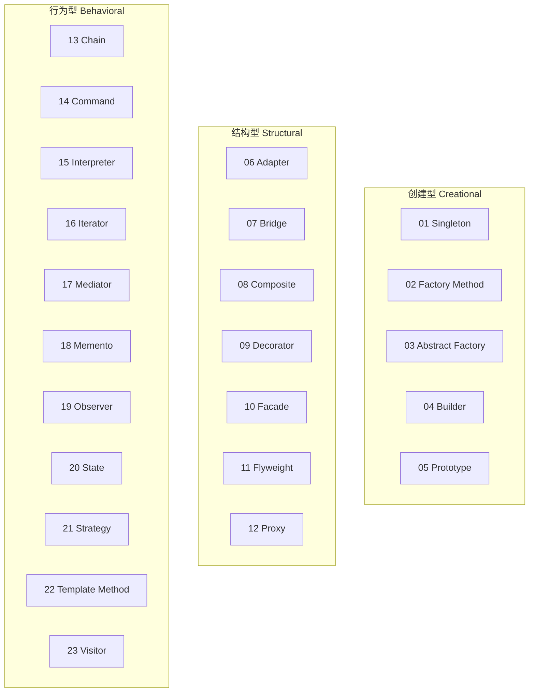
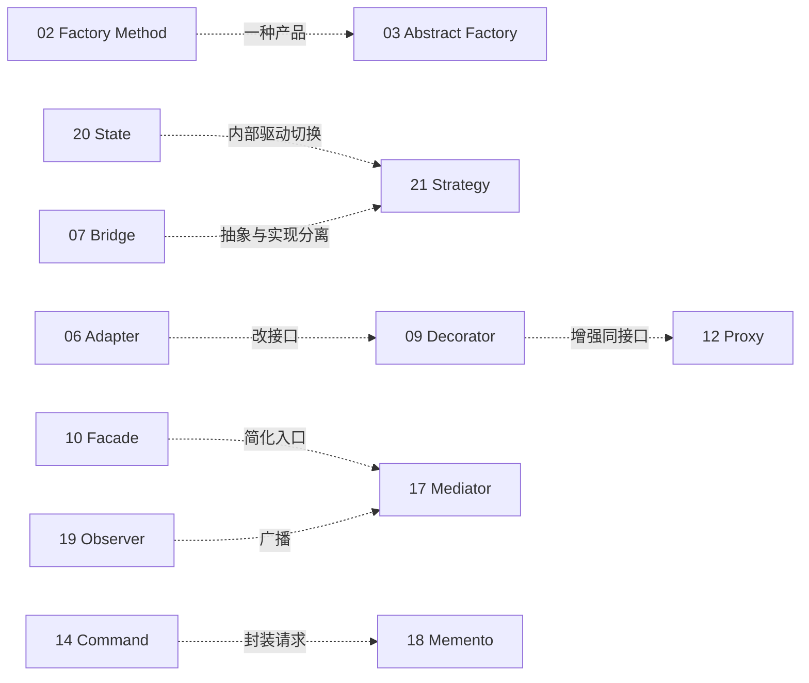
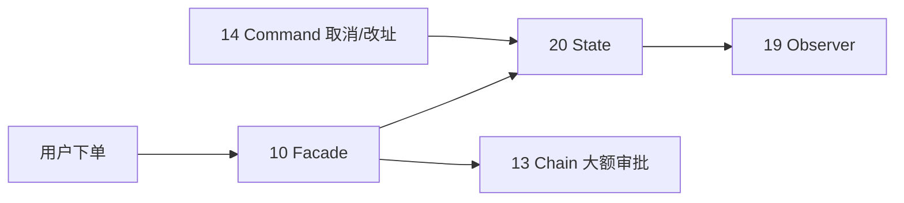

# 23 种设计模式关系总图

便于把握模式分类、易混淆对与典型组合。

## 分类一览

## 易混淆模式对

## 电商场景常用组合

运行端到端演示：`python scripts/ecommerce_demo.py`

## 速查

| 若你需要… | 优先考虑 |
|-----------|----------|
| 全局唯一配置 | Singleton |
| 一族产品一起换 | Abstract Factory |
| 分步构建复杂对象 | Builder |
| 旧接口对接 | Adapter |
| 动态叠加能力 | Decorator |
| 简化多子系统调用 | Facade |
| 状态驱动行为变化 | State |
| 算法可替换 | Strategy |
| 一对多通知 | Observer |
| 撤销操作 | Command |

详见 [PATTERNS_COMPARE.md](PATTERNS_COMPARE.md)、[ECOMMERCE_SCENARIO.md](ECOMMERCE_SCENARIO.md)。
