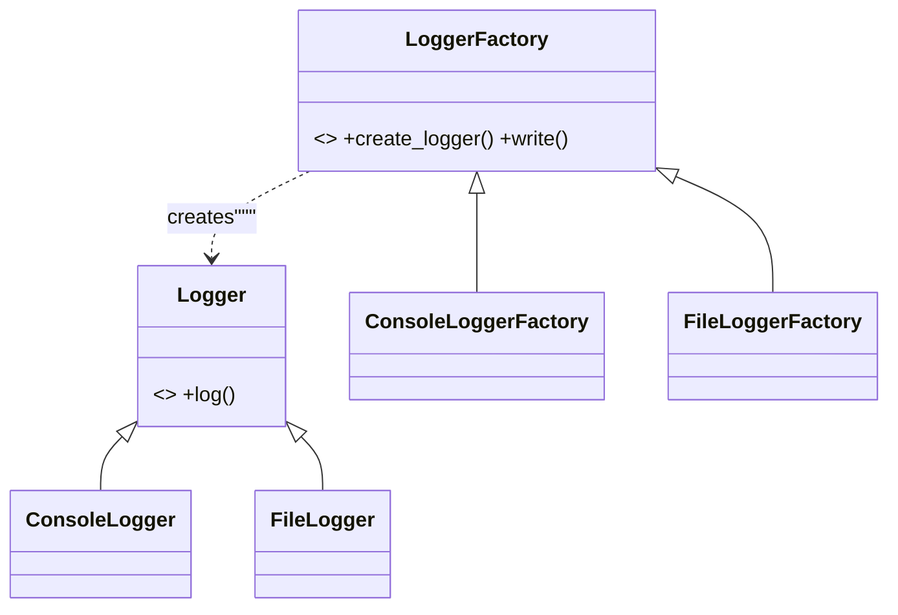
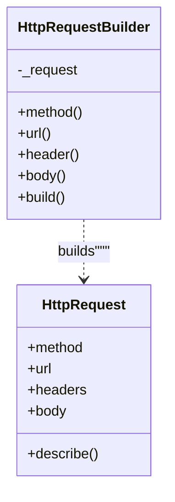
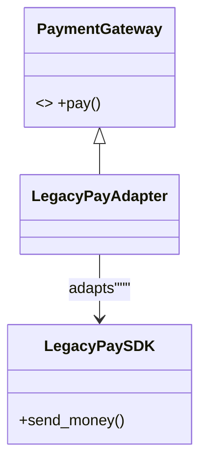
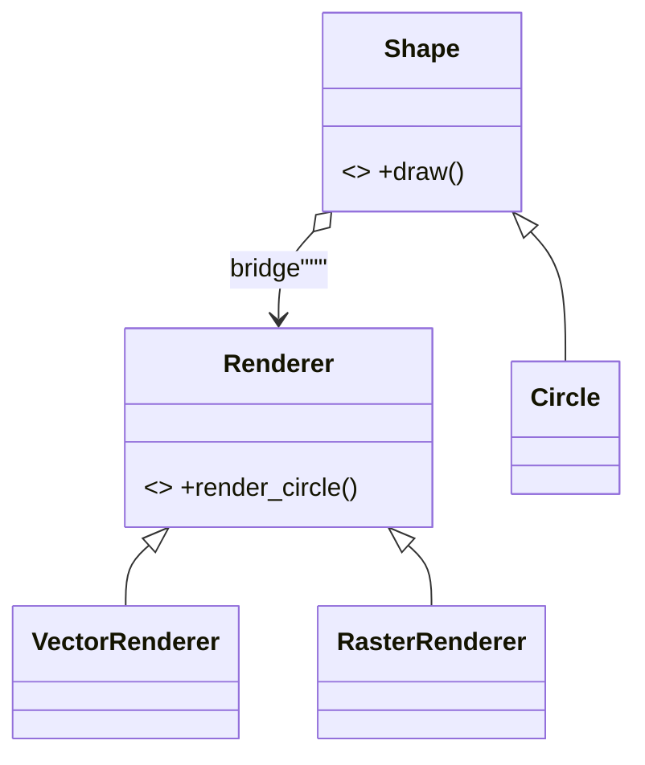
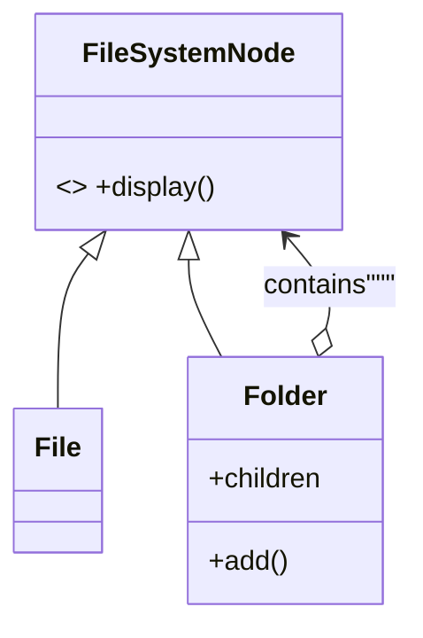
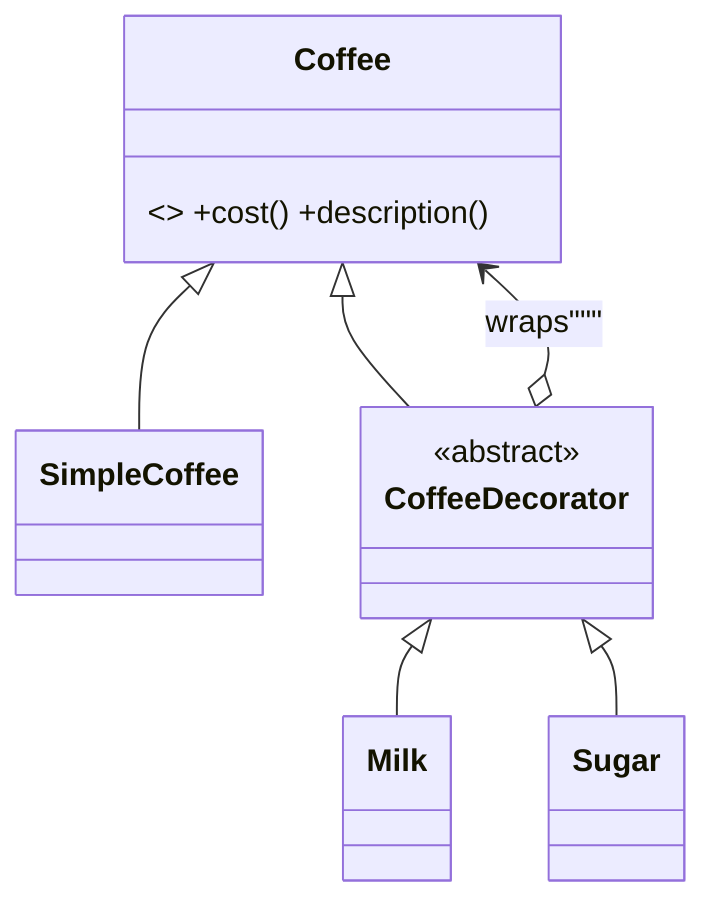
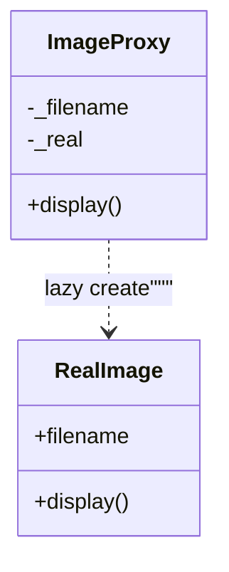
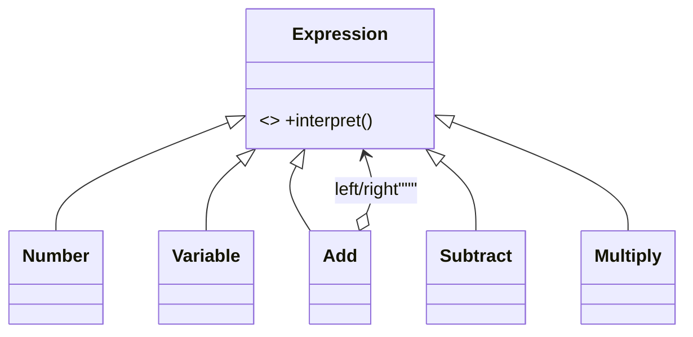
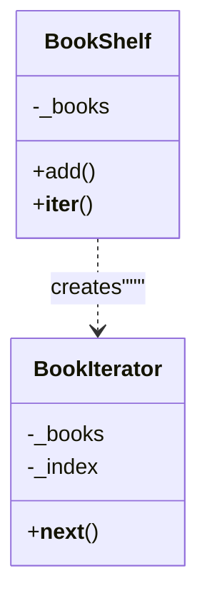
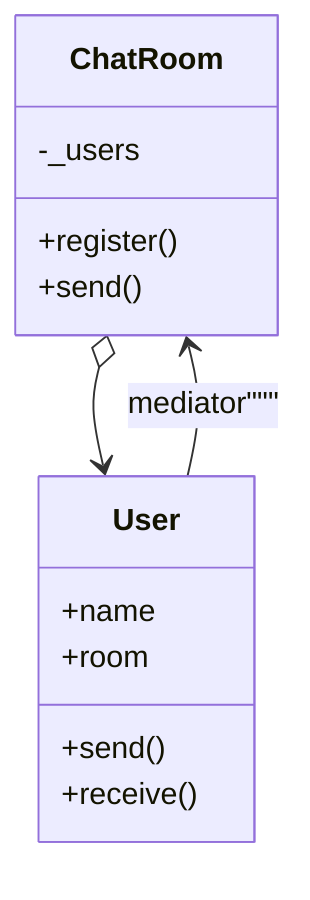

# 23 Patterns — UML Class Diagrams

> Generated by `scripts/generate_uml_page.py`. Paste blocks into https://mermaid.live

## 01_singleton

```mermaid
classDiagram
class AppConfig {
-_instance$
-_initialized
+theme
}
class ThreadSafeAppConfig {
-_instance$
-_lock$
+theme
}"""
```

## 02_factory_method



## 03_abstract_factory

```mermaid
classDiagram
class Button { <<abstract>> +render() }
class TextBox { <<abstract>> +render() }
class DarkButton
class DarkTextBox
class LightButton
class LightTextBox
class UIFactory { <<abstract>> +create_button() +create_textbox() }
class DarkThemeFactory
class LightThemeFactory
Button <|-- DarkButton
Button <|-- LightButton
TextBox <|-- DarkTextBox
TextBox <|-- LightTextBox
UIFactory <|-- DarkThemeFactory
UIFactory <|-- LightThemeFactory
UIFactory ..> Button
UIFactory ..> TextBox"""
```

## 04_builder



## 05_prototype

```mermaid
classDiagram
class Document {
+title
+content
+tags
+clone()
}"""
```

## 06_adapter



## 07_bridge



## 08_composite



## 09_decorator



## 10_facade

```mermaid
classDiagram
class Inventory { +reserve() }
class Payment { +charge() }
class Shipping { +ship() }
class OrderFacade {
-_inventory
-_payment
-_shipping
+place_order()
}
OrderFacade --> Inventory
OrderFacade --> Payment
OrderFacade --> Shipping"""
```

## 11_flyweight

```mermaid
classDiagram
class GlyphStyle {
+font
+size
+color
}
class CharacterFlyweight {
-_pool$
+char
+style
+get()
+render()
}
CharacterFlyweight --> GlyphStyle"""
```

## 12_proxy



## 13_chain_of_responsibility

```mermaid
classDiagram
class Handler { <<abstract>> +handle() +set_next() }
class Manager
class Director
class CEO
class DynamicApprovalChain {
-_handlers
+add_handler()
+remove_handler()
+handle()
}
Handler <|-- Manager
Handler <|-- Director
Handler <|-- CEO
Handler --> Handler : next
DynamicApprovalChain o--> Handler"""
```

## 14_command

```mermaid
classDiagram
class Command { <<abstract>> +execute() +undo() }
class InsertCommand
class TextEditor { +content +insert() +delete() }
class CommandHistory { +run() +undo() }
Command <|-- InsertCommand
InsertCommand --> TextEditor
CommandHistory o--> Command"""
```

## 15_interpreter



## 16_iterator



## 17_mediator



## 18_memento

```mermaid
classDiagram
class EditorMemento {
+content
}
class Editor {
+content
+type()
+save()
+restore()
}
class History {
-_snapshots
+push()
+pop()
}
Editor ..> EditorMemento : save/restore
History o--> EditorMemento"""
```

## 19_observer

```mermaid
classDiagram
class Observer { <<abstract>> +update() }
class Investor
class StockMarket {
-_observers
+subscribe()
+set_price()
}
class WeakStockMarket {
-_observers
+subscribe()
+set_price()
}
Observer <|-- Investor
StockMarket o--> Observer
WeakStockMarket o--> Observer"""
```

## 20_state

```mermaid
classDiagram
class OrderState { <<abstract>> +pay() +ship() }
class PendingState
class PaidState
class ShippedState
class Order {
+state
+pay()
+ship()
}
OrderState <|-- PendingState
OrderState <|-- PaidState
OrderState <|-- ShippedState
Order o--> OrderState"""
```

## 21_strategy

```mermaid
classDiagram
class SortStrategy { <<abstract>> +sort() }
class BubbleSort
class QuickSort
class Sorter {
-_strategy
+sort()
}
SortStrategy <|-- BubbleSort
SortStrategy <|-- QuickSort
Sorter o--> SortStrategy"""
```

## 22_template_method

```mermaid
classDiagram
class DataExporter { <<abstract>> +export() #build_header() #build_body() +build_footer() }
class CsvExporter
class JsonExporter
DataExporter <|-- CsvExporter
DataExporter <|-- JsonExporter"""
```

## 23_visitor

```mermaid
classDiagram
class FileNode {
+name
+size
}
class FolderNode {
+name
+children
}
class Visitor { <<abstract>> +visit_file() +visit_folder() }
class SizeVisitor
class PrintVisitor
Visitor <|-- SizeVisitor
Visitor <|-- PrintVisitor
Visitor ..> FileNode
Visitor ..> FolderNode
FolderNode o--> FileNode"""
```
